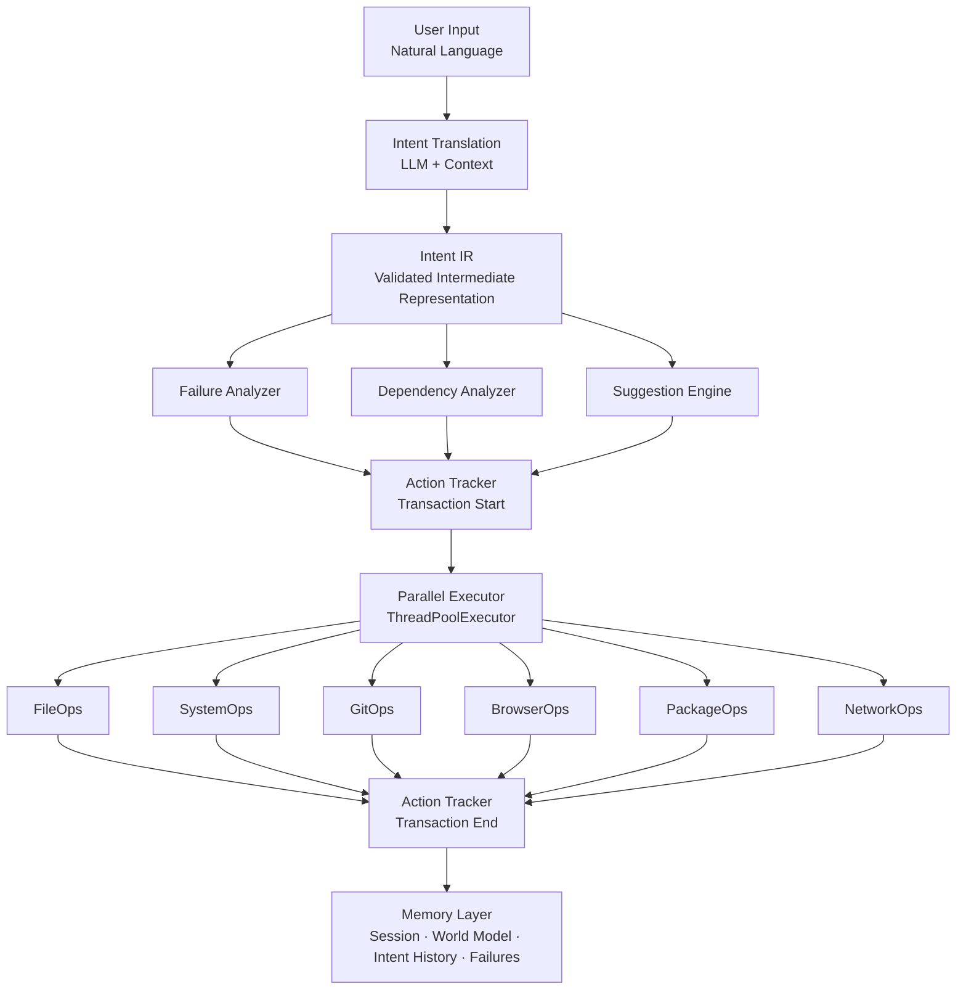
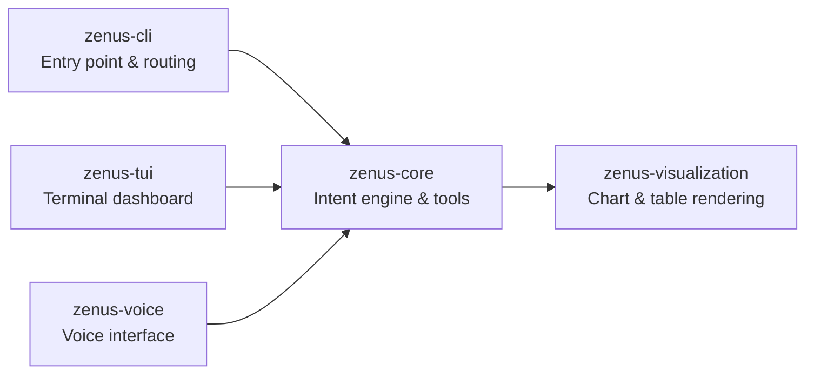

# Zenus

**An AI-mediated system layer that translates natural language into validated system operations.**

Zenus sits between you and the operating system. You describe what you want; Zenus figures out the right commands, checks them for safety, and executes them—tracking everything so mistakes can be undone.

```bash
$ zenus "organize my downloads by file type"
✓ Plan executed successfully

$ zenus "show me what's using the most CPU"
✓ Top 5 processes displayed

$ zenus rollback
✓ Successfully rolled back last action
```

---

## Long-term Vision

Zenus is designed with a clear long-term trajectory: **become an operating system**.

Today, Zenus runs on top of Linux as an intent-execution layer. Over time, the architecture is intended to evolve into a full OS where the interface, scheduling, and system management are all mediated through intent rather than traditional commands. Every design decision — from the Intent IR contract to the sandboxed execution model — is made with that future in mind.

The current release is **v0.3.0-alpha**, the foundation of that journey. It is a working system that runs on any Linux machine today.

---

## How It Works



**Key components:**

- **Intent IR** — Every LLM output is validated against a typed schema before execution. No raw text is ever executed. This is the contract that makes Zenus safe and auditable, and the foundation for OS-grade determinism.
- **Failure Analyzer** — Warns before repeating known failures and suggests fixes based on past experience.
- **Dependency Analyzer** — Builds a dependency graph so independent operations can run concurrently.
- **Suggestion Engine** — Proactively recommends optimizations (e.g. wildcards instead of 15 individual files).
- **Action Tracker** — Records every operation as a transaction, enabling rollback.
- **Parallel Executor** — Runs independent steps concurrently via ThreadPoolExecutor.
- **Memory Layer** — Three layers with different lifetimes: session (RAM), world model (disk), intent history (permanent audit trail).

---

## Packages

Zenus is a monorepo. Each package has a defined role and maps to a component in the future OS architecture.



| Package | Description | Future OS Role |
|---------|-------------|----------------|
| `zenus-core` | Intent translation, planning, tool execution, memory, safety | Kernel cognitive layer |
| `zenus-cli` | CLI entry point, argument routing, interactive REPL | System shell |
| `zenus-tui` | Terminal dashboard with execution log, history, memory view | Primary UI surface |
| `zenus-voice` | Speech-to-text and text-to-speech interface | Voice I/O subsystem |
| `zenus-visualization` | Automatic chart and table rendering for command output | Output rendering layer |

---

## Features

### Safety and correctness

- **Intent IR validation** — LLM output is parsed into a typed schema before any execution happens. Malformed or unsafe intents are rejected at the boundary.
- **Dry-run mode** — Preview the full execution plan without running anything: `zenus --dry-run "delete all tmp files"`
- **Sandboxed execution** — Path validation, resource limits, and permission checks on every tool call.
- **Risk assessment** — Destructive operations are flagged before execution.
- **Undo/rollback** — Every operation is tracked as a transaction. `zenus rollback` reverses the last action; `zenus rollback 5` reverses the last five.

### Execution

- **Parallel execution** — Independent operations are automatically detected and run concurrently (2–5x faster for batch work).
- **Adaptive retry** — Failed steps are retried with updated context from the failure observation.
- **Iterative mode** — For complex multi-step tasks, Zenus uses a ReAct loop: execute, observe, adapt.

### Intelligence

- **Failure learning** — Tracks failures in a local database and warns when a previously-failed operation is attempted again.
- **Contextual awareness** — Knows working directory, git status, system state, and recent history when constructing plans.
- **Optimization suggestions** — Detects inefficient patterns (e.g. processing 15 files individually) and suggests better approaches.
- **Tree of Thoughts** — For high-stakes decisions, explores multiple solution paths and selects the best one by evaluating confidence, risk, and speed.
- **Self-reflection** — Critiques its own plan before execution and revises if needed.
- **Goal inference** — Identifies implied steps the user didn't explicitly mention (e.g. adding a backup before a destructive migration).

### Memory

- **Session memory** — Maintains context within a conversation.
- **World model** — Learns persistent facts about your environment (frequent paths, preferred tools, project structure).
- **Intent history** — Complete audit trail of every operation.
- **Failure patterns** — Records what went wrong and what fixed it.

---

## Installation

### Snap (recommended for Linux desktop)

```bash
snap install --classic zenus
```

Or download from [GitHub Releases](https://github.com/Guillhermm/zenus/releases) and install locally:

```bash
snap install --classic --dangerous zenus_0.6.0_amd64.snap
```

### pip

```bash
pip install zenus-cli   # installs zenus and zenus-tui
```

### From source

```bash
git clone https://github.com/Guillhermm/zenus.git
cd zenus
./install.sh       # creates venv, installs packages, configures LLM, sets up aliases
source ~/.bashrc
zenus help
```

The source installer guides you through choosing an LLM backend:

| Backend | Cost | Notes |
|---------|------|-------|
| **Ollama** (local) | Free | Requires 4–16 GB RAM. Full privacy. |
| **Anthropic Claude** | ~$0.003/cmd | Best reasoning. claude-sonnet-4-6 recommended. |
| **DeepSeek** | ~$0.0003/cmd | Strong performance at low cost. |
| **OpenAI** | ~$0.001/cmd | gpt-4o and gpt-4.1 supported. |

### Updating (source install)

```bash
cd zenus && git pull && ./update.sh
```

---

## Usage

### Interactive shell

```bash
$ zenus
zenus > organize my downloads by file type
✓ Moved 47 files into 5 categories

zenus > show disk usage for my home directory
/home/user: 142 GB used / 500 GB total (28%)

zenus > exit
```

### Direct execution

```bash
zenus "list files in ~/Documents"
zenus --dry-run "delete all tmp files"
zenus --iterative "read my research paper and improve chapter 3"
```

### Rollback

```bash
zenus rollback          # Undo last action
zenus rollback 5        # Undo last 5 actions
zenus rollback --dry-run  # Preview what would be undone
```

### History

```bash
zenus history
zenus history --failures
```

### TUI

```bash
zenus-tui
```

---

## What Zenus Can Do

### File operations
- Organize, search, copy, move, read, write files
- Batch operations with wildcard optimization
- Content editing via natural language

### System management
- Disk usage, process monitoring, CPU/memory stats
- Start, stop, restart services
- Package management (apt, dnf, pacman)

### Developer workflows
- Git status, commit, branch, history
- Docker/Podman container management
- Browser automation (screenshot, download, scrape)

### Network
- Download files, ping, HTTP requests

---

## Project Structure

```
zenus/
├── packages/
│   ├── core/              # zenus-core: intent engine
│   │   └── src/zenus_core/
│   │       ├── orchestrator.py        # Main execution coordinator
│   │       ├── rollback.py            # Undo engine
│   │       ├── brain/                 # Intelligence layer
│   │       │   ├── llm/               # LLM adapters (Anthropic, OpenAI, DeepSeek, Ollama)
│   │       │   ├── planner.py
│   │       │   ├── failure_analyzer.py
│   │       │   ├── dependency_analyzer.py
│   │       │   ├── tree_of_thoughts.py
│   │       │   ├── prompt_evolution.py
│   │       │   ├── goal_inference.py
│   │       │   ├── self_reflection.py
│   │       │   └── multi_agent.py
│   │       ├── tools/                 # Tool implementations
│   │       │   ├── file_ops.py
│   │       │   ├── git_ops.py
│   │       │   ├── system_ops.py
│   │       │   ├── browser_ops.py
│   │       │   └── ... (10 tools total)
│   │       ├── memory/                # Session, world model, history
│   │       ├── shell/                 # Interactive shell
│   │       ├── execution/             # Parallel executor
│   │       ├── safety/                # Safety policies
│   │       ├── sandbox/               # Sandboxed execution
│   │       └── audit/                 # Audit logging
│   ├── cli/               # zenus-cli: entry point
│   ├── tui/               # zenus-tui: terminal dashboard
│   ├── voice/             # zenus-voice: voice interface
│   └── visualization/     # zenus-visualization: charts and tables
├── tests/
│   ├── unit/
│   └── integration/
├── docs/
├── config.yaml
└── install.sh
```

---

## Development

### Running tests

```bash
pytest
pytest --cov
pytest tests/unit/ -v
```

### Contributing

- Additional tool implementations
- LLM adapter improvements
- Test coverage
- Documentation

---

## Roadmap

See [ROADMAP.md](ROADMAP.md) for the full roadmap.

### Current (v0.3.0-alpha)
- Natural language to system operations
- Parallel execution with dependency analysis
- Failure learning and adaptive retry
- Undo/rollback (transaction-based)
- Optimization suggestions
- 10 tool categories
- Multi-LLM support (Anthropic, OpenAI, DeepSeek, Ollama)
- TUI dashboard
- Self-reflection and plan critique
- Tree of Thoughts planning
- Goal inference

### Near-term
- Voice interface stabilization
- Plugin/skill system
- Enhanced semantic search over history
- Streaming output in TUI

### Long-term (toward Zenus as OS)
- Persistent world model across reboots
- Multi-user support with isolated contexts
- Custom Linux distribution
- Hardware abstraction layer
- Replace shell as primary system interface

---

## License

GNU General Public License v3 — see [LICENSE](LICENSE).

---

## Support

- **Issues**: [GitHub Issues](https://github.com/Guillhermm/zenus/issues)
- **Discussions**: [GitHub Discussions](https://github.com/Guillhermm/zenus/discussions)
- **Documentation**: [docs/](docs/)

---

*Zenus: computing driven by intent, not commands.*
