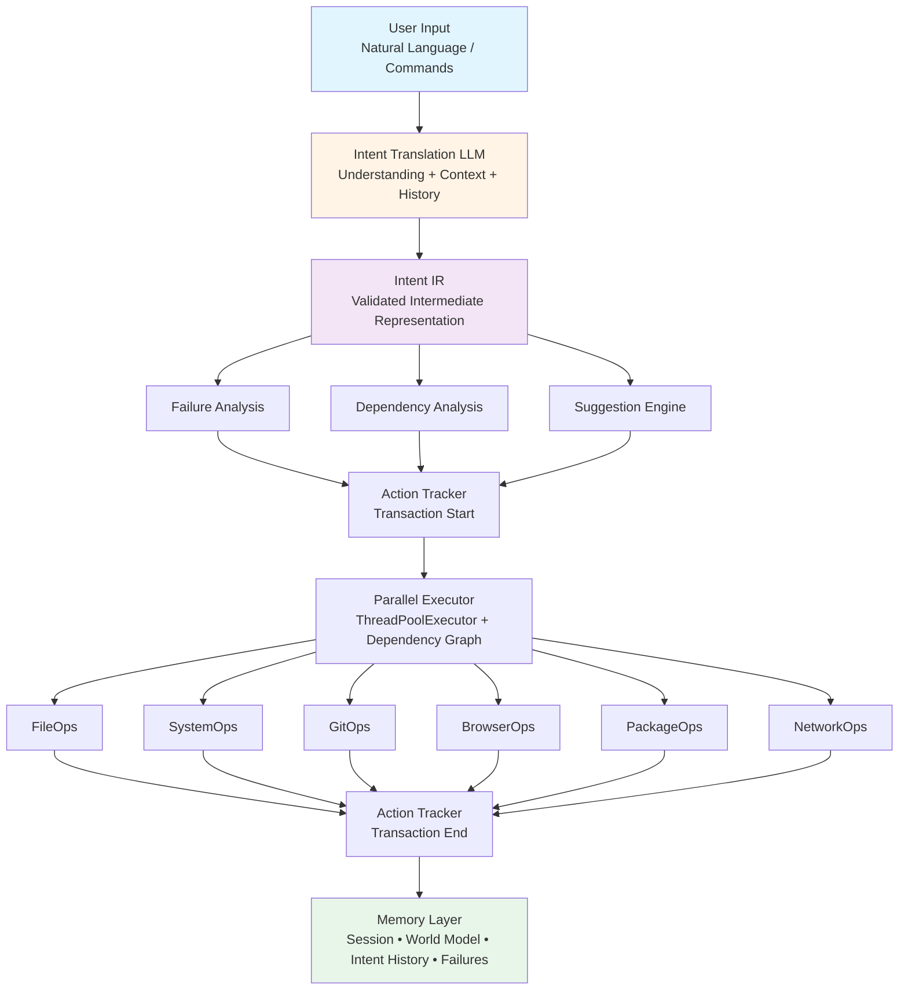

# Zenus OS Architecture

Complete system design and technical architecture.

---

## System Overview

Zenus OS follows a pipeline architecture that transforms natural language input into validated, safe system operations:

```
User Input → Translation → Validation → Analysis → Execution → Memory
```

### High-Level Data Flow



---

## Core Components

### 1. CLI Layer (`src/cli/`)

**Orchestrator** (`orchestrator.py`):
- Main execution coordinator
- Manages pipeline flow
- Integrates all intelligence components
- Handles errors and retries

**Router** (`router.py`):
- Command-line argument parsing
- Mode selection (direct, interactive, rollback, history)
- Flag handling (dry-run, iterative)

**Rollback Engine** (`rollback.py`):
- Executes inverse operations
- Feasibility analysis
- Checkpoint management
- Dry-run support

**Formatter** (`formatter.py`):
- Rich console output
- Color-coded messages
- Progress indicators
- Error display

### 2. Brain Layer (`src/brain/`)

**LLM Integration** (`llm/`):
- Factory pattern for multiple providers
- Adapters: OpenAI, DeepSeek, Ollama
- Streaming support
- Schema validation (Pydantic)

**Task Analyzer** (`task_analyzer.py`):
- Complexity detection
- Automatic iterative mode triggering
- Confidence scoring
- Heuristic-based analysis

**Failure Analyzer** (`failure_analyzer.py`):
- Error categorization (8 types)
- Pre-execution warnings
- Post-failure suggestions
- Recovery plan generation
- Retry decision logic

**Dependency Analyzer** (`dependency_analyzer.py`):
- Dependency graph building
- Resource conflict detection
- Topological sorting
- Execution level calculation

**Suggestion Engine** (`suggestion_engine.py`):
- Rule-based suggestions
- Optimization detection
- Warning generation
- Confidence scoring

**Planners**:
- `planner.py`: Basic sequential execution
- `adaptive_planner.py`: Retry with observation
- `sandboxed_planner.py`: Safety-enforced execution

### 3. Memory Layer (`src/memory/`)

**Failure Logger** (`failure_logger.py`):
- SQLite-backed persistence
- Pattern normalization
- Suggestion tracking
- Success rate calculation

**Action Tracker** (`action_tracker.py`):
- Transaction grouping
- Rollback strategy determination
- Checkpoint creation
- Operation history

**Session Memory** (`session_memory.py`):
- Current context tracking
- Reference resolution ("it", "that file")
- Short-term memory

**World Model** (`world_model.py`):
- Learned preferences
- Frequent paths
- Usage patterns
- Long-term memory

**Intent History** (`intent_history.py`):
- Complete audit trail
- JSONL format
- Query capabilities

### 4. Execution Layer (`src/execution/`)

**Parallel Executor** (`parallel_executor.py`):
- ThreadPoolExecutor-based
- Dependency-aware scheduling
- Resource management
- Graceful error handling
- Performance metrics

**Resource Limiter**:
- CPU/memory limits
- I/O throttling
- Concurrent operation limits

### 5. Tools Layer (`src/tools/`)

**Registry** (`registry.py`):
- Tool registration and discovery
- Capability mapping
- Dynamic loading

**Tool Implementations**:
- `file_ops.py`: File system operations
- `system_ops.py`: System monitoring
- `process_ops.py`: Process management
- `package_ops.py`: Package management (apt/dnf/pacman)
- `browser_ops.py`: Browser automation (Playwright)
- `git_ops.py`: Git operations
- `network_ops.py`: HTTP/download/ping
- `service_ops.py`: Systemd services
- `container_ops.py`: Docker/Podman
- `text_ops.py`: Text processing

### 6. Safety Layer (`src/safety/`)

**Validator**:
- Path validation
- Permission checks
- Resource limit enforcement
- Command whitelisting

**Sandbox** (`src/sandbox/`):
- chroot-like boundaries
- System file protection
- Resource isolation

### 7. Audit Layer (`src/audit/`)

**Logger** (`logger.py`):
- Structured logging
- Intent tracking
- Error logging
- Performance metrics

---

## Revolutionary Features (v0.4.0 - v0.5.0)

### Model Router

**Intelligent LLM Selection** - Routes tasks based on complexity:
- Simple tasks (list files, status) → DeepSeek (cheap, fast)
- Complex tasks (analysis, refactoring) → Claude (powerful)
- Automatic fallback cascade
- Real-time cost tracking
- 50-75% cost reduction

**Implementation**: `brain/model_router.py`, `brain/task_complexity.py`

### Intent Memoization

**Cache Intent IR Translations** - Eliminates redundant LLM calls:
- Hash-based caching (user_input + context)
- 1-hour TTL with LRU eviction
- Persistent cache across sessions
- 2-3x speedup for repeated commands
- 30-40% token reduction

**Implementation**: `execution/intent_cache.py`

### Tree of Thoughts

**Multi-Path Solution Exploration** - Generates and evaluates 3-5 alternative approaches:
- Parallel solution generation
- Confidence scoring per approach
- Risk assessment and pros/cons
- Intelligent path selection
- Example: "deploy app" explores Docker Compose, Kubernetes, systemd

**Implementation**: `brain/tree_of_thoughts.py`

### Self-Reflection

**Pre-Execution Plan Critique** - Validates plans before execution:
- Confidence scoring (0-100%) per step
- Issue detection (ambiguity, missing info, risks)
- Smart question generation
- Risk assessment and safeguard suggestions
- Proceeds automatically when safe, asks when unsure

**Implementation**: `brain/self_reflection.py`

### Prompt Evolution

**Self-Improving Prompts** - Learns from every execution:
- Tracks success rates per command type
- Auto-tunes prompts based on failures
- A/B testing with automatic promotion
- No manual prompt engineering needed
- Continuous learning from your workflows

**Implementation**: `brain/prompt_evolution.py`

### Multi-Agent Collaboration

**Specialized Agent Coordination** - Multiple AI agents work together:
- ResearcherAgent, PlannerAgent, ExecutorAgent, ValidatorAgent
- Agent communication protocol
- Hierarchical planning (manager → workers)
- Use cases: code review, research + implementation, testing + debugging

**Implementation**: `brain/multi_agent.py`

### Proactive Monitoring

**System Health Surveillance** - Watches and alerts before problems occur:
- Disk space warnings (80% warning, 90% critical)
- High CPU/memory usage alerts
- Failed services detection
- Security updates notifications
- Automatic remediation when safe

**Implementation**: `monitoring/proactive_monitor.py`

### Data Visualization

**Automatic Data Formatting** - Beautiful visualizations without manual work:
- Auto-detects data types (processes, disk usage, stats)
- Rich tables with borders and colors
- Progress bars for resource usage
- Color coding (green/yellow/red)
- File trees with icons
- Syntax highlighting

**Implementation**: `visualization/auto_visualizer.py`

### Feedback Collection

**User Feedback Loop** - Continuous improvement:
- Thumbs up/down prompts
- Success rate tracking per tool/intent
- Training data export
- Privacy-aware sanitization
- Statistics dashboard

**Implementation**: `feedback/collector.py`

### Enhanced Error Handling

**User-Friendly Error Messages** - Actionable suggestions:
- Categorized errors (permission, not_found, network, timeout)
- Context-aware explanations
- 3-5 suggestions per error type
- Fallback command recommendations

**Implementation**: `execution/error_handler.py`

### Observability & Metrics

**Performance Monitoring** - Real-time insights:
- Command latency tracking
- Token usage and cost per command
- Cache hit rate monitoring
- Success rate tracking
- Per-model statistics
- Historical data access

**Implementation**: `observability/metrics.py`

---

## Intent IR (Intermediate Representation)

The core contract between understanding and execution:

```python
class Step(BaseModel):
    tool: str                    # Tool name (e.g., "FileOps")
    action: str                  # Action name (e.g., "read_file")
    args: Dict[str, Any]         # Action arguments
    risk: int                    # Risk level (0-3)

class IntentIR(BaseModel):
    goal: str                    # Human-readable goal
    requires_confirmation: bool  # Needs user approval?
    steps: List[Step]            # Ordered execution steps
```

**Example**:
```json
{
  "goal": "Organize downloads by file type",
  "requires_confirmation": false,
  "steps": [
    {
      "tool": "FileOps",
      "action": "scan",
      "args": {"path": "~/Downloads"},
      "risk": 0
    },
    {
      "tool": "FileOps",
      "action": "move",
      "args": {
        "source": "~/Downloads/*.pdf",
        "dest": "~/Downloads/PDFs/"
      },
      "risk": 1
    }
  ]
}
```

**Risk Levels**:
- **0**: Read-only, no side effects
- **1**: Modify existing resources
- **2**: Significant changes (install/uninstall)
- **3**: Destructive, irreversible

---

## Execution Pipeline

### 1. Intent Translation

```
User Input → LLM → Raw JSON → Pydantic Validation → Intent IR
```

**Process**:
1. User input + context sent to LLM
2. LLM generates structured JSON
3. Pydantic validates schema
4. Intent IR created

**Failure handling**:
- Schema validation errors → IntentTranslationError
- LLM errors → Retry with backoff
- Invalid tool/action → Validation error

### 2. Pre-Execution Analysis

**Parallel analyses**:
- **Failure Analysis**: Check past failures, warn if risky
- **Dependency Analysis**: Build graph for parallel execution
- **Suggestion Analysis**: Generate optimization suggestions

**Outputs**:
- Warnings for user
- Suggested modifications
- Execution strategy (sequential/parallel)

### 3. Execution

**Sequential Path**:
```
for step in intent.steps:
    result = execute_step(step)
    track_action(step, result)
```

**Parallel Path**:
```
levels = dependency_analyzer.calculate_levels(intent)

for level in levels:
    if len(level) == 1:
        execute_sequential(level[0])
    else:
        execute_parallel(level)  # ThreadPoolExecutor
```

**Transaction tracking**:
```
tx_id = tracker.start_transaction()
try:
    results = execute(intent)
    tracker.end_transaction(tx_id, "completed")
except:
    tracker.end_transaction(tx_id, "failed")
    raise
```

### 4. Post-Execution

**Success**:
- Update memory (session, world model, history)
- Track action for rollback
- Log success metrics

**Failure**:
- Analyze failure type
- Generate suggestions
- Offer recovery plan
- Update failure patterns

---

## Parallel Execution

### Dependency Graph

**Resource conflicts**:
- Same file path
- Same package
- Same URL
- Same service

**File dependencies**:
- Step B reads what Step A writes
- Step B modifies what Step A creates

**Implicit ordering**:
- Package operations (sequential)
- Git operations (sequential)
- Same-tool operations (check for conflicts)

### Topological Sort

```python
def calculate_levels(intent):
    edges = build_dependency_graph(intent)
    levels = []
    
    while unprocessed_nodes:
        # Find nodes with no dependencies
        current_level = [n for n in nodes if in_degree[n] == 0]
        levels.append(current_level)
        
        # Update in-degrees
        for node in current_level:
            for dependent in dependents_of(node):
                in_degree[dependent] -= 1
    
    return levels
```

**Result**:
```
Level 1: [0, 1, 2]  # Can run in parallel
Level 2: [3, 4]     # Can run in parallel (after Level 1)
Level 3: [5]        # Sequential (depends on all previous)
```

### Thread Pool

```python
with ThreadPoolExecutor(max_workers=4) as executor:
    futures = {
        executor.submit(execute_step, step): step_id
        for step_id in level
    }
    
    for future in as_completed(futures):
        result = future.result()
        results[futures[future]] = result
```

---

## Rollback System

### Action Tracking

Every operation is recorded with rollback metadata:

```python
{
  "transaction_id": "tx_abc123",
  "tool": "FileOps",
  "operation": "create_file",
  "params": {"path": "/tmp/test.txt"},
  "rollback_possible": true,
  "rollback_strategy": "delete",
  "rollback_data": {"path": "/tmp/test.txt"}
}
```

### Rollback Strategies

| Operation | Strategy | Data |
|-----------|----------|------|
| create_file | delete | {path} |
| delete_file | restore | {backup_path} |
| move_file | move_back | {from, to} |
| copy_file | delete_copy | {dest} |
| install | uninstall | {package} |
| uninstall | reinstall | {package} |
| commit | git_reset | {commit_hash} |
| start | stop | {service} |
| stop | start | {service} |
| run (container) | stop_and_remove | {container_id} |

### Transaction Grouping

Operations are grouped into atomic transactions:

```
Transaction tx_abc123:
  [1] FileOps.create_file
  [2] FileOps.write_file
  [3] GitOps.commit

Rollback:
  [3] git_reset (reverse order)
  [2] restore_content
  [1] delete
```

---

## Memory Architecture

### Four-Layer System

```
┌──────────────────────────────────────┐
│       Session Memory (RAM)           │
│   Current context, references        │
└──────────────────────────────────────┘
                  │
┌──────────────────────────────────────┐
│    World Model (JSON file)           │
│   Learned preferences, patterns      │
└──────────────────────────────────────┘
                  │
┌──────────────────────────────────────┐
│   Intent History (JSONL)             │
│   Complete audit trail               │
└──────────────────────────────────────┘
                  │
┌──────────────────────────────────────┐
│   Failure Database (SQLite)          │
│   Pattern learning, suggestions      │
└──────────────────────────────────────┘
```

### Session Memory

**Purpose**: Short-term context within a conversation

**Contents**:
- Recent references ("it", "that file")
- Current working directory
- Recent paths mentioned
- Active intent context

**Lifetime**: Current session only (RAM)

### World Model

**Purpose**: Learned long-term knowledge

**Contents**:
```json
{
  "frequent_paths": {
    "/home/user/projects": 42,
    "/home/user/Downloads": 38
  },
  "preferred_tools": {
    "FileOps": 156,
    "GitOps": 89
  },
  "naming_patterns": [
    "*.py",
    "test_*.py",
    "*_config.json"
  ]
}
```

**Lifetime**: Persistent (JSON file)

### Intent History

**Purpose**: Complete audit trail

**Format**: JSONL (one intent per line)
```jsonl
{"timestamp": "2024-01-01T10:00:00", "input": "...", "intent": {...}, "results": [...]}
{"timestamp": "2024-01-01T10:05:00", "input": "...", "intent": {...}, "results": [...]}
```

**Lifetime**: Persistent (unlimited retention)

### Failure Database

**Purpose**: Pattern learning and suggestion management

**Schema**:
```sql
-- All failures
CREATE TABLE failures (
    id INTEGER PRIMARY KEY,
    timestamp TEXT,
    user_input TEXT,
    tool TEXT,
    error_type TEXT,
    error_message TEXT,
    context_json TEXT,
    resolution TEXT
);

-- Learned patterns
CREATE TABLE failure_patterns (
    id INTEGER PRIMARY KEY,
    pattern_hash TEXT UNIQUE,
    count INTEGER,
    last_seen TEXT,
    suggested_fix TEXT,
    success_after_fix INTEGER
);
```

**Lifetime**: Persistent (SQLite)

---

## Safety Architecture

### Multi-Layer Protection

```
User Input
    ↓
[1] Intent Validation
    ↓
[2] Risk Assessment
    ↓
[3] Path Validation
    ↓
[4] Permission Check
    ↓
[5] Resource Limits
    ↓
Execution
```

### Layer 1: Intent Validation

- Schema validation (Pydantic)
- Tool existence check
- Action availability check
- Parameter type checking

### Layer 2: Risk Assessment

- Risk level calculation (0-3)
- Destructive operation detection
- User confirmation for high-risk
- Dry-run recommendation

### Layer 3: Path Validation

- Absolute path resolution
- Home directory enforcement
- System file protection
- Symlink resolution

### Layer 4: Permission Check

- File/directory permissions
- Service control permissions
- Package manager permissions
- Container runtime permissions

### Layer 5: Resource Limits

- Memory limits
- CPU limits
- I/O throttling
- Concurrent operation limits

---

## Performance Architecture

### Optimization Layers

**1. LLM Level**:
- Streaming responses
- Prompt optimization
- Model selection (small for simple tasks)

**2. Execution Level**:
- Parallel execution (ThreadPoolExecutor)
- Batch operations (wildcards)
- Caching (repeated operations)

**3. I/O Level**:
- Async I/O where applicable
- Buffered file operations
- Connection pooling

### Metrics Collection

```python
{
  "intent_translation_ms": 350,
  "failure_analysis_ms": 15,
  "dependency_analysis_ms": 22,
  "execution_ms": 450,
  "total_ms": 837,
  "parallel_speedup": 3.2
}
```

---

## Extension Points

### Adding New Tools

```python
from tools.base import BaseTool

class MyCustomTool(BaseTool):
    def list_operations(self):
        return ["my_action"]
    
    def execute(self, action: str, args: dict):
        if action == "my_action":
            return self.my_action(**args)
    
    def my_action(self, param1: str):
        # Implementation
        return {"result": "success"}
```

### Adding LLM Providers

```python
from brain.llm.base import LLMBackend

class MyLLM(LLMBackend):
    def translate_intent(self, user_input: str) -> IntentIR:
        # Call your LLM API
        # Parse response
        # Return Intent IR
        pass
```

### Adding Rollback Strategies

```python
# In action_tracker.py
if tool == "MyTool" and operation == "my_op":
    return {
        "possible": True,
        "strategy": "my_reverse_op",
        "data": {"needed_data": value}
    }

# In rollback.py
elif strategy == "my_reverse_op":
    # Execute reverse operation
    pass
```

---

## Data Flow Examples

### Simple Command

```
"list files in downloads"
    ↓
LLM Translation
    ↓
Intent IR: FileOps.scan
    ↓
Validation ✓
    ↓
No failures in history
    ↓
Sequential execution
    ↓
Result: [file1, file2, ...]
    ↓
Memory update
```

### Complex Parallel Command

```
"download Q1, Q2, Q3, Q4 reports"
    ↓
LLM Translation
    ↓
Intent IR: 4x NetworkOps.download
    ↓
Dependency Analysis
    ↓
Graph: All independent
    ↓
Levels: [[0,1,2,3]]
    ↓
ThreadPoolExecutor
    ↓
4 concurrent downloads
    ↓
Results: All success
    ↓
4x speedup achieved
```

### Failure Learning Flow

```
"docker ps" (first time)
    ↓
Execution fails: Permission denied
    ↓
Failure Analyzer
    ↓
Categorize: permission_denied
    ↓
Generate suggestions + recovery plan
    ↓
Log to failures.db
    ↓
Display to user

"docker ps" (second time)
    ↓
Pre-execution analysis
    ↓
Found similar failure
    ↓
Calculate success probability: 50%
    ↓
Show warning + learned fix
    ↓
Ask for confirmation
```

---

## Technology Stack

### Core
- **Python 3.10+**: Main language
- **Pydantic 2.x**: Schema validation
- **SQLite**: Persistent storage
- **ThreadPoolExecutor**: Concurrency

### LLM Integration
- **OpenAI API**: Cloud LLM
- **DeepSeek API**: Cost-effective cloud
- **Ollama**: Local LLM support

### Tools & Libraries
- **Rich**: Terminal UI
- **Playwright**: Browser automation
- **pytest**: Testing framework
- **JSONL**: Structured logging

### Infrastructure
- **systemd**: Service management
- **Docker/Podman**: Container support
- **Git**: Version control integration

---

**See also**:
- [Intent IR Specification](architecture/02-intent-ir.md)
- [Adaptive Execution](architecture/03-adaptive-execution.md)
- [Memory System](architecture/04-memory-system.md)
- [Sandboxing](architecture/05-sandboxing.md)
