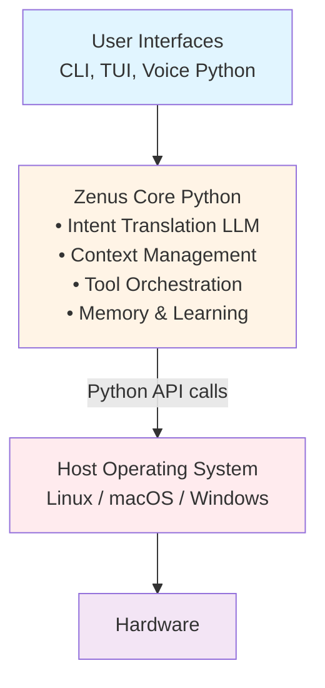
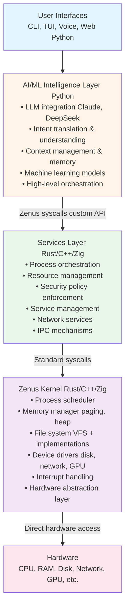
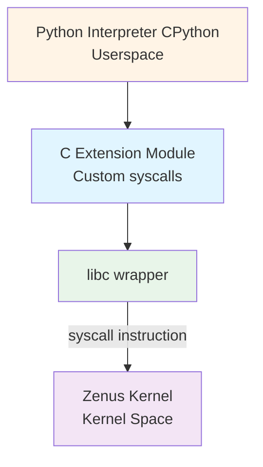
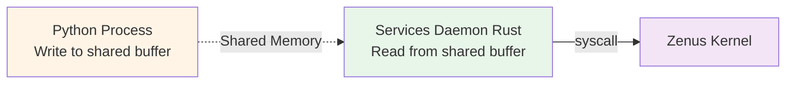
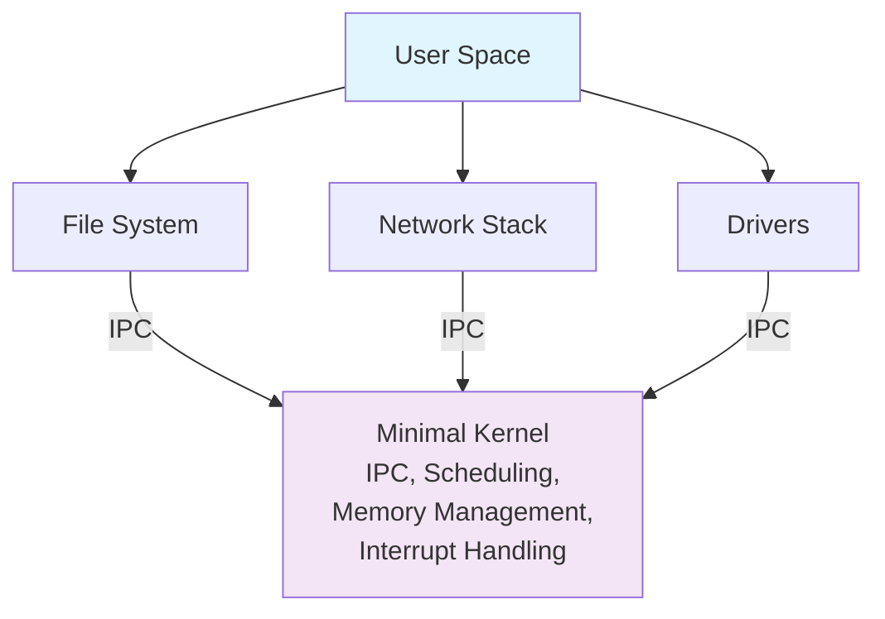
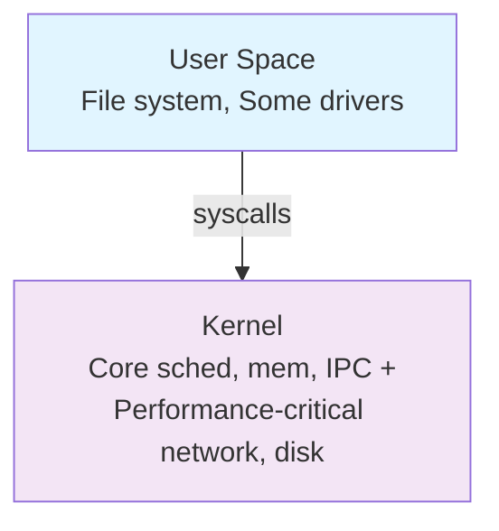

# Zenus OS Future Architecture

**Vision**: Transform Zenus from a Python-based AI assistant into a true operating system.

**Timeline**: Q3 2027 - Q4 2028 (Phase 10 in ROADMAP.md)

**Status**: Design Phase - Not Yet Implemented

---

## Table of Contents

1. [Vision & Motivation](#vision--motivation)
2. [Architectural Evolution](#architectural-evolution)
3. [Three-Layer Architecture](#three-layer-architecture)
4. [Integration Strategy](#integration-strategy)
5. [Technical Decisions](#technical-decisions)
6. [Migration Path](#migration-path)
7. [Challenges & Solutions](#challenges--solutions)
8. [Performance Considerations](#performance-considerations)
9. [Security Model](#security-model)
10. [Development Roadmap](#development-roadmap)

---

## Vision & Motivation

### Why Build a Full OS?

**Current Limitations (v1.x)**:
- Dependent on host OS (Linux/macOS/Windows)
- Limited hardware control
- OS abstraction overhead
- Cannot optimize at kernel level
- No control over process scheduling or memory management

**Future Capabilities (v2.0+)**:
- Direct hardware access and control
- Kernel-level AI integration
- Optimized for AI workloads
- Custom process scheduling with ML predictions
- Intelligent memory management
- Full security control from bare metal

### What Makes This Unique?

**No other AI assistant**:
- Runs at kernel level
- Manages hardware directly
- Combines Python AI intelligence with systems programming
- Designed AI-first from the ground up

**Zenus OS will be**:
- The first AI-powered operating system
- A platform for AI that understands hardware
- A system that learns from every hardware interaction
- An OS that can optimize itself in real-time

---

## Architectural Evolution

### Current Architecture (v1.x)



**Problems**:
- Two abstraction layers (Python → OS → Hardware)
- No control over OS behavior
- Performance overhead
- Limited hardware introspection

### Future Architecture (v2.0+)



**Benefits**:
- One abstraction layer (Python → Kernel → Hardware)
- Full control at every level
- AI-optimized from kernel up
- Direct hardware introspection and control

---

## Three-Layer Architecture

### Layer 1: AI/ML Intelligence (Python)

**Responsibilities**:
- Natural language understanding
- Intent translation to operations
- Context tracking and memory
- Machine learning model execution
- High-level orchestration
- User interaction

**Technology**:
- CPython or MicroPython runtime
- LLM integrations (Anthropic, DeepSeek, local models)
- ML frameworks (sentence-transformers, etc.)
- All current Zenus features

**Interface to Layer 2**:
- Custom syscall API (not POSIX, designed for AI workloads)
- Examples:
  - `zenus_exec(intent_ir: IntentIR) -> ExecutionResult`
  - `zenus_observe(pid: ProcessID) -> SystemState`
  - `zenus_learn(observation: Observation) -> ()` 

**Why Python?**:
- Massive AI/ML ecosystem
- Rapid development and iteration
- Rich library support
- Easy to extend and customize
- Community familiarity

### Layer 2: Services & Orchestration (Rust/C++/Zig)

**Responsibilities**:
- Translate AI intents to system operations
- Resource allocation and scheduling
- Security policy enforcement
- Service lifecycle management
- Network protocol implementation
- Inter-process communication

**Technology**:
- Compiled systems language (Rust preferred)
- User-space services/daemons
- Hybrid synchronous/asynchronous design
- Message-passing between components

**Interface to Layer 3**:
- Standard syscalls (read, write, open, etc.)
- Custom syscalls for Zenus-specific features
- Memory-mapped I/O for performance-critical paths

**Why This Layer?**:
- Bridge between high-level AI and low-level kernel
- Security boundary (policy enforcement)
- Performance optimization without kernel complexity
- Easier to debug and update than kernel code

### Layer 3: Zenus Kernel (Rust/C++/Zig)

**Responsibilities**:
- Process and thread scheduling
- Virtual memory management
- File system implementations
- Device driver framework
- Hardware abstraction layer
- Interrupt and exception handling
- Boot and initialization

**Technology**:
- Rust (preferred for memory safety) or C++/Zig
- Custom microkernel or hybrid design
- Zero-copy interfaces where possible
- Lock-free data structures for performance

**Interface to Hardware**:
- Direct register access (MMIO)
- DMA for bulk transfers
- Hardware interrupts
- Platform-specific assembly

**Design Principles**:
- Minimize kernel complexity
- Push features to userspace when possible
- AI-aware scheduling (predict process behavior)
- Real-time support for latency-sensitive AI

---

## Integration Strategy

### Python ↔ Kernel Communication

**Challenge**: Python is interpreted, kernel is native code.

**Solution 1: Embedded Python Runtime**



**Solution 2: IPC via Shared Memory**



**Chosen Approach**: Hybrid
- Critical path: Syscalls for low latency
- Bulk data: Shared memory for efficiency
- Async operations: Message queues

### Memory Management

**Challenges**:
- Python uses garbage collection
- Kernel needs manual memory management
- Prevent Python from corrupting kernel memory

**Solution**:
1. **Separate address spaces**: Python runs in user mode, kernel in kernel mode
2. **Memory protection**: MMU enforces boundaries
3. **Controlled interfaces**: Syscalls validate all pointers
4. **Pinned memory**: For DMA buffers shared with Python
5. **GC integration**: Kernel notifies Python of memory pressure

**Example Flow**:
```python
# Python code
data = zenus_syscall("read_file", path="/etc/config")
# Kernel allocates buffer, copies data to userspace
# Python GC manages userspace memory
```

### Error Handling

**Across Language Boundaries**:

| Layer | Error Type | Handling |
|-------|-----------|----------|
| Python | Exception | Try/except, logged to kernel |
| Services | Result<T, E> | Error codes to Python |
| Kernel | Panic | Log, potentially restart service |

**Approach**:
- Kernel never panics on userspace errors
- Services translate errors to Python exceptions
- Python logs errors, may retry or ask user

---

## Technical Decisions

### Decision 1: Kernel Programming Language

**Options**:

| Language | Pros | Cons | Verdict |
|----------|------|------|---------|
| **Rust** | Memory safety, modern tooling, fearless concurrency | Steep learning curve, strict compiler | **Recommended** |
| **C++** | Performance, mature ecosystem, flexibility | Easy to make mistakes, undefined behavior | Alternative |
| **Zig** | Simplicity, great C interop, explicit control | Less mature, smaller community | Experimental |
| **C** | Maximum control, proven track record | Very easy to make mistakes, no safety | Not recommended |

**Recommendation**: **Rust**
- Memory safety prevents 70% of kernel bugs
- Growing ecosystem (Redox OS, Tock OS, Linux Rust)
- Excellent tooling (Cargo, clippy, rustfmt)
- Community momentum

### Decision 2: Kernel Architecture

**Microkernel**:



Pros: Isolation, debuggability, modularity  
Cons: IPC overhead, complexity

**Monolithic**:


Pros: Performance, simplicity  
Cons: One crash kills all, harder to debug

**Hybrid (Recommended)**:


Pros: Balance of performance and modularity  
Cons: Design complexity

**Recommendation**: **Hybrid**
- Core in kernel (scheduler, memory, interrupts)
- File systems in userspace (easier to add/debug)
- Critical drivers in kernel (disk, network)
- Services in userspace (AI orchestration)

### Decision 3: Python Integration

**Option A: Embedded CPython**
- Full Python compatibility
- Large memory footprint (~30MB+ runtime)
- Slower startup

**Option B: MicroPython**
- Tiny footprint (~256KB runtime)
- Fast startup
- Limited standard library

**Option C: Hybrid** (Recommended)
- CPython for development/desktop
- MicroPython for embedded/edge devices
- Conditional compilation based on target

---

## Migration Path

See [ROADMAP.md Phase 10](#) for detailed timeline.

### Phase 10a: Design (Q3 2027)
- Finalize technical decisions
- Write kernel specification
- Design syscall API
- Plan toolchain setup

### Phase 10b: Minimal Kernel (Q4 2027)
- Boot on x86_64 (QEMU first)
- Basic memory management
- Simple round-robin scheduler
- Hello world from bare metal

### Phase 10c: File System & Drivers (Q1 2028)
- VFS layer
- RAM disk or simple ext2
- Disk driver (virtio or AHCI)
- Network driver (virtio-net or E1000)

### Phase 10d: Python Runtime (Q2 2028)
- Port CPython/MicroPython
- Implement syscall bindings
- Test basic Python scripts
- Benchmark performance

### Phase 10e: Tool Migration (Q3 2028)
- Port FileOps, SystemOps, etc.
- Native implementations where needed
- Integration testing
- Performance tuning

### Phase 10f: Release (Q4 2028)
- ISO image creation
- Installer development
- Documentation
- Public beta

---

## Challenges & Solutions

### Challenge 1: Driver Development

**Problem**: Writing device drivers is hard and time-consuming.

**Solutions**:
- Start with virtual drivers (virtio in QEMU)
- Reuse open-source drivers where possible
- Focus on common hardware first (Intel NICs, AHCI, NVMe)
- Community contributions for exotic hardware

### Challenge 2: Python Performance Overhead

**Problem**: Python is slower than native code.

**Solutions**:
- Hot path in Rust/C++, orchestration in Python
- JIT compilation (PyPy) for performance-critical code
- Pre-compile common operations
- Cache aggressively

### Challenge 3: Debugging Kernel Code

**Problem**: Kernel bugs can crash the system.

**Solutions**:
- Develop and test in QEMU first
- Serial console logging
- Kernel debugger (GDB with QEMU)
- Extensive unit tests
- Fuzzing for edge cases

### Challenge 4: Hardware Compatibility

**Problem**: Thousands of hardware variations.

**Solutions**:
- Focus on server/datacenter hardware first (more uniform)
- Virtual machine support (VirtualBox, VMware, QEMU)
- Community testing program
- Tiered support (Tier 1: guaranteed, Tier 2: best effort, Tier 3: community)

### Challenge 5: Community Adoption

**Problem**: Users comfortable with current v1.x.

**Solutions**:
- Maintain v1.x for 2+ years
- Clear migration path and tooling
- Dual-boot support
- Showcase killer features only possible in v2.0

---

## Performance Considerations

### Benchmarks & Goals

| Metric | v1.x (Python on Linux) | v2.0 Target (Zenus OS) |
|--------|------------------------|------------------------|
| Boot time | N/A (host OS + app) | <5 seconds |
| Command latency | 100-500ms (LLM + OS) | 50-200ms (LLM + kernel) |
| Memory overhead | 100MB+ (Python + OS) | 30MB (Python + kernel) |
| Syscall latency | ~1µs (OS) | ~100ns (direct) |
| Context switch | ~5µs (OS) | ~1µs (custom scheduler) |

### Optimization Strategies

1. **Zero-Copy I/O**: DMA directly to Python buffers where safe
2. **Async Syscalls**: Non-blocking by default, queue-based
3. **Custom Scheduler**: AI-aware (predict which process runs next)
4. **JIT for Python**: PyPy or custom JIT for hot loops
5. **Memory Pools**: Pre-allocated buffers for common sizes
6. **Lock-Free Kernel**: RCU and other lock-free algorithms

---

## Security Model

### Kernel-Level Security

**Capabilities-Based**:
- Not all processes are root/user
- Fine-grained permissions (read /tmp, write /home/user, network access, etc.)
- Principle of least privilege

**Memory Protection**:
- MMU enforces userspace/kernel boundary
- ASLR (Address Space Layout Randomization)
- NX bit (No Execute) for data pages

**Audit Trail**:
- All syscalls logged (optional, configurable)
- AI-powered anomaly detection
- Real-time alerts for suspicious patterns

### AI Safety

**Sandboxing**:
- AI runs in userspace, no direct hardware access
- Kernel validates all operations
- Resource limits (CPU, memory, disk I/O)

**Intent Validation**:
- Kernel understands dangerous operations
- Requires confirmation for:
  - System-wide changes
  - Destructive file operations
  - Network operations to unknown hosts

---

## Development Roadmap

### Milestones

**M1: Bootable Hello World** (Q4 2027)
- Boot on x86_64 in QEMU
- Print "Zenus OS" to screen
- Proof of concept complete

**M2: Memory & Processes** (Q1 2028)
- Page allocator working
- Process creation and scheduling
- Context switching functional
- Run simple user programs

**M3: Drivers & File System** (Q2 2028)
- Disk I/O working
- File system can read/write files
- Network packets can send/receive
- Basic shell runs

**M4: Python Integration** (Q3 2028)
- Python interpreter runs
- Syscalls accessible from Python
- Port 10 core Zenus tools
- End-to-end intent execution working

**M5: Beta Release** (Q4 2028)
- ISO image available
- Installable on real hardware
- Documentation complete
- 100+ community testers

**M6: Production Release** (Q1 2029)
- Stable on common hardware
- Migration tools complete
- Performance meets targets
- Public launch

---

## References & Inspiration

### Existing Projects

- **Redox OS**: Rust-based Unix-like OS (microkernel)
  - https://www.redox-os.org/
- **Tock OS**: Embedded OS in Rust
  - https://www.tockos.org/
- **seL4**: Formally verified microkernel
  - https://sel4.systems/
- **Linux Rust Support**: Rust in Linux kernel
  - https://rust-for-linux.com/
- **Minix 3**: Microkernel for reliability
  - https://www.minix3.org/

### Learning Resources

- "Operating Systems: Three Easy Pieces" by Remzi Arpaci-Dusseau
- "The Rust Programming Language" (The Book)
- "OS Dev Wiki": https://wiki.osdev.org/
- "Writing an OS in Rust" by Philipp Oppermann
  - https://os.phil-opp.com/

---

## Conclusion

Building a true operating system is ambitious, but achievable with a clear plan and incremental execution.

**Key Takeaways**:
1. Hybrid architecture preserves Python's AI strengths while adding kernel-level control
2. Rust provides memory safety critical for kernel development
3. Incremental migration allows v1.x users to transition smoothly
4. Focus on virtual machines first, bare metal second
5. Community involvement is essential

**Next Steps**:
1. Finalize technical decisions (language, architecture)
2. Set up development environment (Rust toolchain, QEMU)
3. Write minimal boot code
4. Iterate rapidly in safe environments (VMs)
5. Share progress transparently with community

**This document will evolve** as we make progress and learn from implementation.

---

*Last updated: 2026-02-27*  
*Status: Design Phase*  
*See also: [ROADMAP.md](../ROADMAP.md), [ARCHITECTURE.md](ARCHITECTURE.md)*
