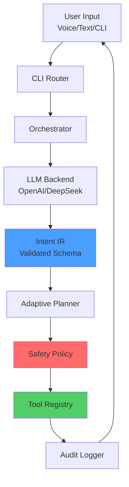
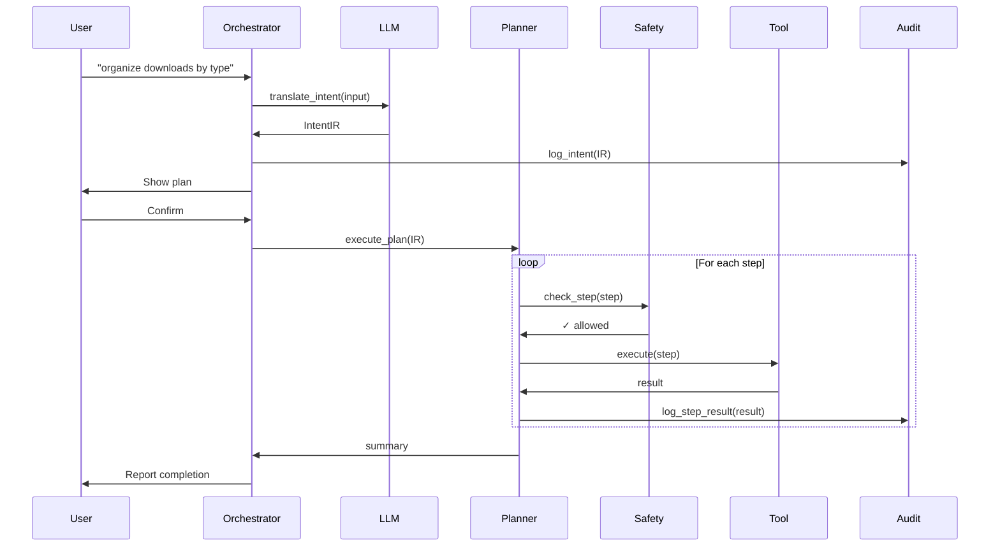
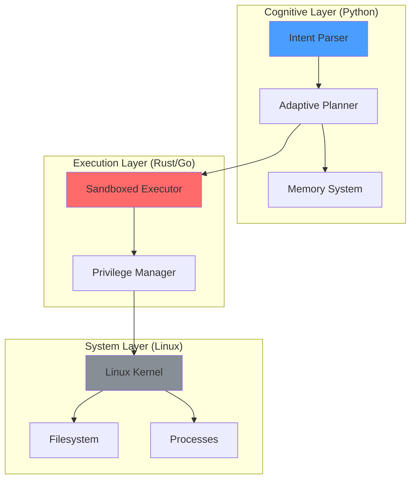

# Zenus OS - System Architecture Overview

## Core Philosophy

Zenus OS is a cognitive operating layer that translates human intent into safe, deterministic system actions. Unlike conversational AI assistants, Zenus operates through formal intermediate representations with explicit safety contracts.

## High-Level Architecture

## Component Responsibilities

### CLI Layer
- **Router**: Parse arguments, route to modes (help/version/shell/direct)
- **Orchestrator**: Manage full pipeline, handle confirmations, coordinate execution

### Brain Layer
- **LLM Backend**: Translate natural language to Intent IR
- **Planner**: Execute plans with observation and adaptation
- **Memory**: Context retention and learning (future)

### Execution Layer
- **Tools**: FileOps, SystemOps, ProcessOps with explicit contracts
- **Safety Policy**: Risk assessment and permission gates
- **Audit Logger**: JSONL logs for all operations

## Data Flow

## Key Design Decisions

### 1. Intent IR as Contract
All LLM outputs must conform to IntentIR schema. Raw text never executes.

### 2. Safety First
Every operation has explicit risk level (0-3). High-risk operations require confirmation.

### 3. Auditability
Every intent, plan, and execution is logged to `~/.zenus/logs/` in structured JSONL.

### 4. LLM Backend Agnostic
Abstract interface allows swapping OpenAI, DeepSeek, or local models without changing core.

### 5. Tool Contracts
Tools declare capabilities, arguments, and risk levels explicitly.

## Future Architecture

## Comparison: OpenClaw vs Zenus

| Aspect | OpenClaw | Zenus OS |
|--------|----------|----------|
| Interaction | Conversational | Intent-driven |
| Safety | Plugin marketplace | Formal contracts |
| Execution | Flexible, async | Deterministic, validated |
| Architecture | Agent + tools | OS layer + tools |
| Focus | Task automation | System control |

Zenus is not trying to be more flexible than OpenClaw. It's trying to be more correct.
