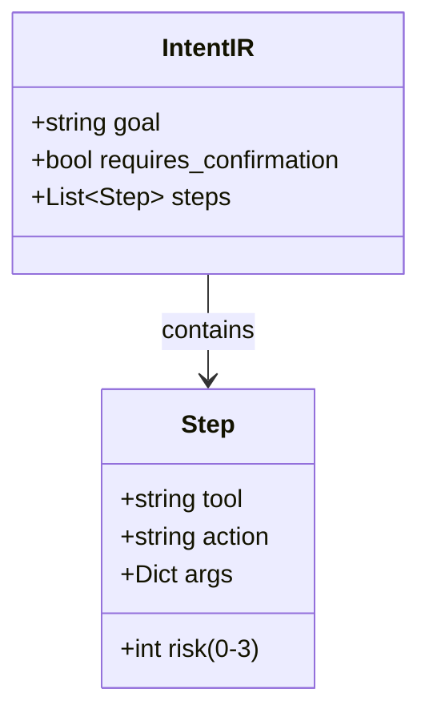

# Intent IR - The Core Contract

## Purpose

IntentIR (Intermediate Representation) is the formal language that separates user intent from system execution. It is Zenus's "assembly language."

## Schema Definition



## Risk Levels

| Level | Meaning | Examples | Confirmation |
|-------|---------|----------|--------------|
| 0 | Read-only | scan, info, list | No |
| 1 | Create/Move | mkdir, move, touch | Optional |
| 2 | Modify | write_file, overwrite | Yes |
| 3 | Delete/Kill | delete, kill | Always |

## Example

```json
{
  "goal": "Organize downloads by file type",
  "requires_confirmation": true,
  "steps": [
    {
      "tool": "FileOps",
      "action": "scan",
      "args": {"path": "~/Downloads"},
      "risk": 0
    },
    {
      "tool": "FileOps",
      "action": "mkdir",
      "args": {"path": "~/Downloads/Images"},
      "risk": 1
    },
    {
      "tool": "FileOps",
      "action": "move",
      "args": {
        "source": "~/Downloads/*.jpg",
        "destination": "~/Downloads/Images"
      },
      "risk": 1
    }
  ]
}
```

## Validation Rules

1. **Tool Existence**: Tool name must exist in registry
2. **Action Validity**: Action must be defined for tool
3. **Argument Completeness**: All required args present
4. **Risk Coherence**: Risk level matches action semantics
5. **Safety Compliance**: High-risk steps flagged for confirmation

## Why This Matters

**Without IR**: LLM output executes directly (unsafe, opaque)
**With IR**: LLM output is compiled, validated, audited

This is the difference between a chatbot and an operating system.
