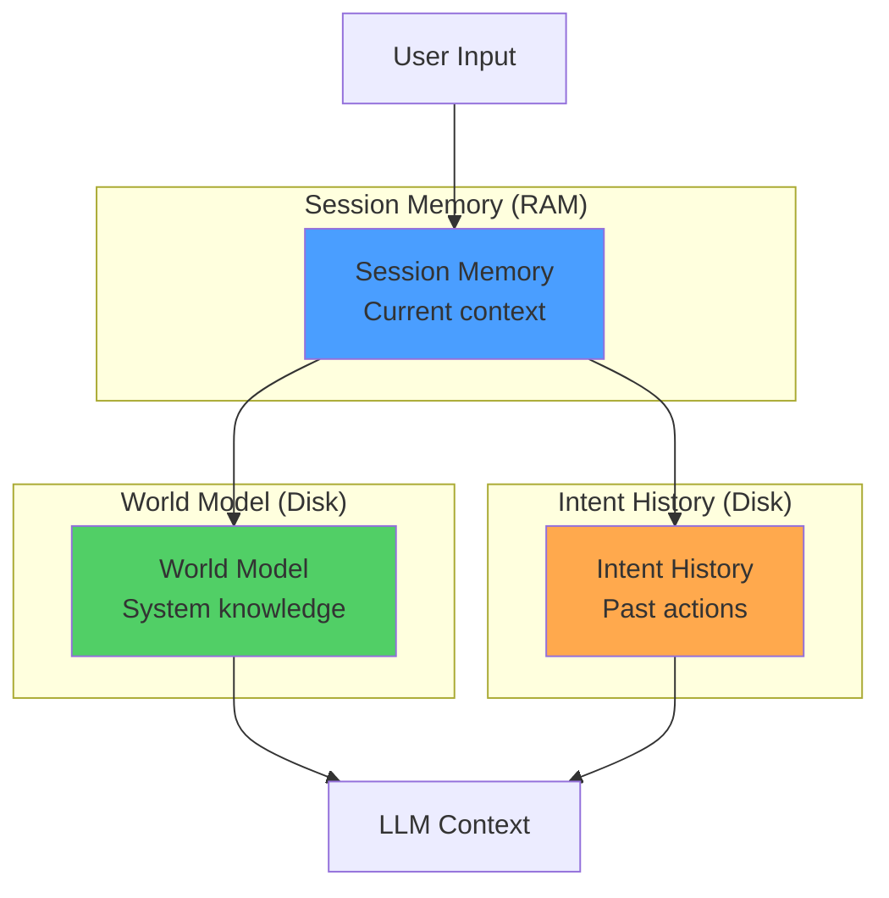
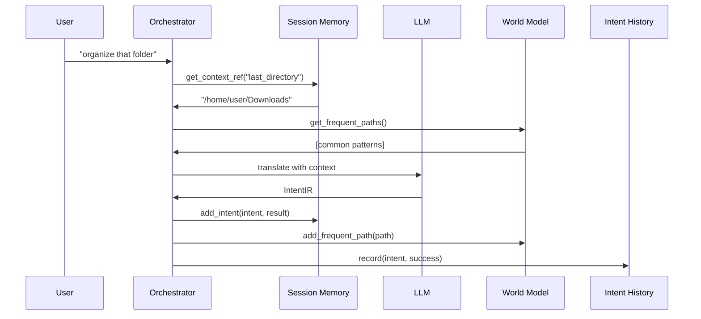

# Memory System Architecture

## Problem Statement

Without memory, every Zenus interaction is context-free:
- "Organize that folder" -> What folder?
- "Show me those files again" -> Which files?
- "Do the same thing for Documents" -> What thing?

Memory enables context, learning, and intelligence.

## Three-Layer Memory Architecture



## Layer 1: Session Memory (Short-Term)

**Purpose:** Track context within current session

**Lifetime:** Clears on session end

**Stores:**
- Recent intents and results
- Context references ("that folder", "those files")
- Execution state

**Example:**
```python
session = SessionMemory()
session.add_intent(
    "organize downloads", 
    intent, 
    "success"
)
session.add_context_ref("last_directory", "/home/user/Downloads")

# Later in same session
"show me that directory again"
-> context_ref resolves to "/home/user/Downloads"
```

## Layer 2: World Model (Long-Term Knowledge)

**Purpose:** Persistent knowledge about system and user

**Lifetime:** Persists forever (until explicitly cleared)

**Stores:**
- Frequent paths (learned from usage)
- User preferences
- Application locations
- Recurring patterns

**Storage:** `~/.zenus/world_model.json`

**Example:**
```python
world = WorldModel()

# Track usage
world.add_frequent_path("~/projects/zenus_os")

# Learn preferences
world.set_preference("backup_location", "~/Backups")

# Recognize patterns
world.add_pattern("User backs up on Fridays")
```

## Layer 3: Intent History (Audit + Learning)

**Purpose:** Complete record of all past intents

**Lifetime:** Permanent (rotates monthly)

**Stores:**
- Every intent execution
- Success/failure outcomes
- Timestamps
- Performance metrics

**Storage:** `~/.zenus/history/history_YYYY-MM.jsonl`

**Example:**
```python
history = IntentHistory()

history.record(
    user_input="organize downloads",
    goal="Organize files by type",
    steps_count=5,
    success=True,
    duration_seconds=2.3
)

# Later: learn from history
similar = history.search("organize", limit=5)
stats = history.get_stats(days=7)
```

## Memory Integration Flow



## Context-Aware Intent Translation

With memory, LLM gets richer context:

**Without Memory:**
```
User: "organize that folder"
LLM: ??? (ambiguous)
```

**With Memory:**
```
Context:
- Last directory: ~/Downloads
- Frequent paths: ~/Documents, ~/projects
- Recent intent: "scan downloads"
- Pattern: User organizes weekly

User: "organize that folder"
LLM: Organize ~/Downloads by file type
```

## Privacy and Control

**User Controls:**
- Clear session memory anytime
- Delete world model
- Purge intent history
- Export all memory data

**Privacy Principles:**
- All memory stored locally
- No memory sent to LLM servers
- User owns all memory data
- Transparent storage format (JSON/JSONL)

## Future Enhancements

### 1. Vector-Based Semantic Memory
Store embeddings of past intents for semantic search:
```python
# Find similar past intents
similar = memory.find_similar("organize files", k=5)
```

### 2. Active Learning
Learn from corrections:
```python
# User corrects a misunderstanding
memory.record_correction(
    original_intent="delete tmp files",
    corrected_intent="move tmp files to trash"
)
```

### 3. Proactive Suggestions
Based on patterns:
```python
# Friday 5pm detected
if memory.has_pattern("backup on Friday"):
    suggest("Would you like to run your usual backup?")
```

## Implementation Status

```
✓ Session Memory (complete)
✓ World Model (complete)
✓ Intent History (complete)
○ LLM context integration (next)
○ Vector semantic search (future)
○ Active learning (future)
```

## Why This Matters

Memory transforms Zenus from:
- **Reactive** → **Context-aware**
- **Stateless** → **Continuous**
- **Forgetful** → **Learning**

This is the foundation for true autonomy.
