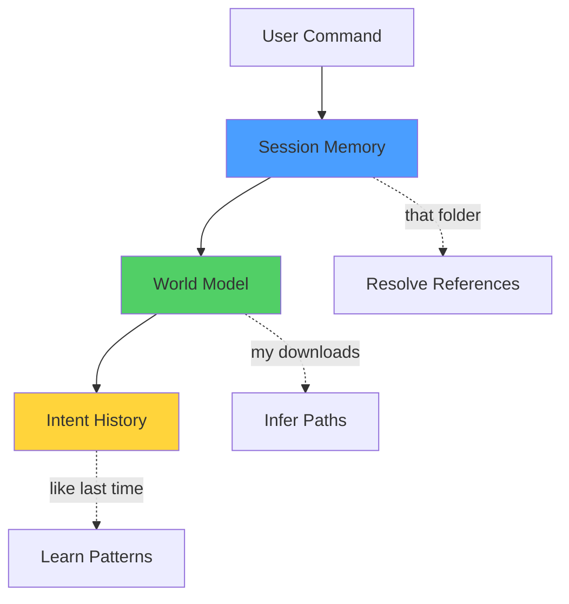

# Memory System

## Purpose

Enable Zenus to remember context across commands and sessions, making interaction feel natural and intelligent rather than stateless.

## Architecture



## Three Layers of Memory

### 1. Session Memory (Short-Term)

**Lifetime:** Current session only
**Purpose:** Resolve ambiguous references

```python
# User says: "scan my downloads"
session.remember_entity("directory", "downloads", {"path": "~/Downloads"})

# Later, user says: "organize that folder"
# Zenus resolves "that folder" -> ~/Downloads
```

**What It Tracks:**
- Last 10 intents and results
- Recently accessed entities (files, directories, processes)
- Conversation context variables

**Key Methods:**
```python
session.remember_entity(type, name, metadata)
session.resolve_reference("that folder")
session.get_last_result()
```

### 2. World Model (Long-Term)

**Lifetime:** Persistent across all sessions
**Purpose:** Understand user's system and preferences

```python
# User frequently works in ~/projects/zenus_os
world.remember_path("zenus", "~/projects/zenus_os")
world.remember_project("zenus_os", path, "python")

# Later, user says: "test zenus"
# Zenus knows: zenus -> ~/projects/zenus_os -> pytest
```

**What It Stores:**
- User preferences (default editor, shell, etc.)
- Frequently used paths with aliases
- Known applications and locations
- Project directories and metadata
- System configuration

**Key Methods:**
```python
world.set_preference(key, value)
world.remember_path(alias, path)
world.remember_project(name, path, type)
world.get_application(name)
```

### 3. Intent History (Long-Term + Searchable)

**Lifetime:** Persistent, organized by date
**Purpose:** Learn from past executions

```python
# Record every intent
history.record(user_input, intent_ir, success, result)

# Analyze patterns
success_rate = history.get_success_rate(days=7)
popular = history.get_popular_goals()
failures = history.analyze_failures()
```

**What It Records:**
- Every intent execution (success or failure)
- Original command and generated plan
- Execution outcome
- Timestamp and metadata

**Key Methods:**
```python
history.record(input, intent, success, result)
history.search(query)
history.get_success_rate(days)
history.analyze_failures()
```

## Example Usage

### Scenario: Organizing Files

```python
# First command
User: "scan my downloads folder"

# Zenus execution:
session.remember_entity("directory", "downloads", {
    "path": "~/Downloads",
    "files_count": 127
})
world.remember_path("downloads", "~/Downloads")

# Second command (minutes later)
User: "organize that folder by file type"

# Zenus resolves:
folder = session.resolve_reference("that folder")
# -> {"path": "~/Downloads", "files_count": 127}

# Zenus can now execute without asking "which folder?"
```

### Scenario: Project Work

```python
# User works on a project
User: "create a python project called my_app"

# Zenus records:
world.remember_project("my_app", "~/projects/my_app", "python", {
    "venv": "~/projects/my_app/.venv",
    "created": "2026-02-09"
})

# Days later
User: "run tests for my_app"

# Zenus knows:
project = world.get_project("my_app")
# -> path, type, venv location
# Can automatically: cd to path, activate venv, run pytest
```

## Data Storage

### Session Memory
- **Location:** In-memory only
- **Format:** Python objects
- **Cleared:** On session end

### World Model
- **Location:** `~/.zenus/world_model.json`
- **Format:** JSON
- **Persisted:** Continuously

### Intent History
- **Location:** `~/.zenus/history/intents_YYYY-MM-DD.jsonl`
- **Format:** JSONL (one JSON object per line)
- **Persisted:** Daily files

## Future Enhancements

### 1. Vector Embeddings
Store embeddings of past commands for semantic search:
```
User: "do what I did last week with the downloads"
-> Find semantically similar past intent
```

### 2. Learning Preferences
Automatically learn preferences from patterns:
```
User always organizes by "type" not "date"
User prefers ~/backup not ~/Backup
User's Python projects always use pytest
```

### 3. Context Prediction
Predict what user will ask based on context:
```
User scans ~/Downloads with 200 files
-> Likely next: organize or clean up
```

### 4. Cross-Session Continuity
```
Yesterday at 5pm: User was working on project X
Today at 9am: "continue where I left off"
-> Resume project X context
```

## Integration Points

Memory system integrates with:
- **Orchestrator:** Passes session memory to LLM for context
- **Adaptive Planner:** Uses history to improve retry strategies
- **Tools:** Update world model when discovering new entities
- **Audit Logger:** Feeds intent history for analysis

## Why This Matters

Without memory, every command is a cold start:
```
User: "scan my downloads"
User: "organize that folder"
Zenus: "Which folder?" ❌
```

With memory, conversation flows naturally:
```
User: "scan my downloads"
User: "organize that folder"
Zenus: *organizes ~/Downloads* ✓
```

This is the difference between a command executor and an intelligent assistant.
