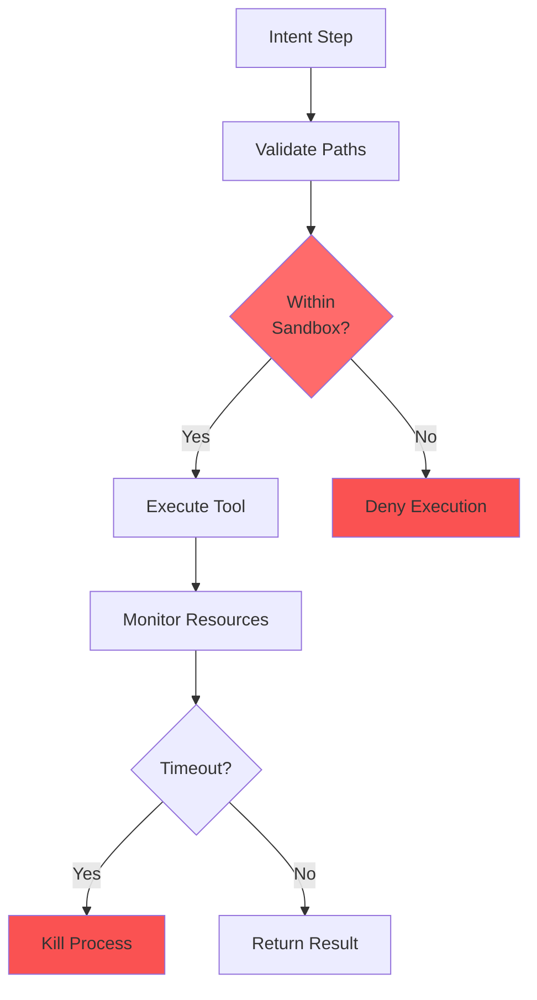
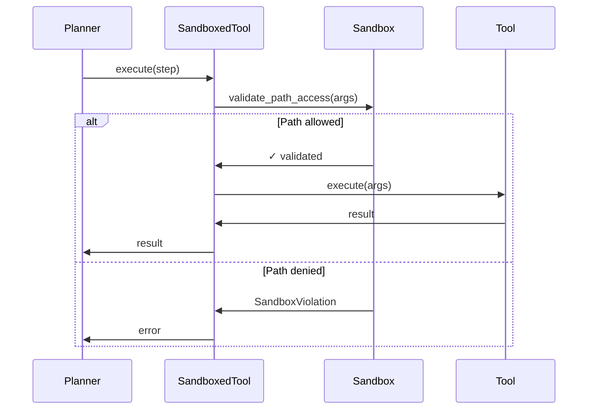

# Sandboxing Architecture

## Problem Statement

Without sandboxing, tools can:
- Access any file on the system
- Run forever (resource exhaustion)
- Make network requests
- Execute arbitrary code

For an OS-level system, this is unacceptable.

## Sandboxing Strategy



## Sandbox Layers

### Layer 1: Path Validation (Basic)

**Controls:** Filesystem access

**Mechanism:**
- Whitelist of allowed paths (default: user home)
- Blacklist of read-only paths (/usr, /lib, /bin)
- Pre-execution validation

**Example:**
```python
sandbox = SandboxedExecutor()
sandbox.validate_path_access("/home/user/file.txt", write=True)  # OK
sandbox.validate_path_access("/etc/passwd", write=True)  # Denied
```

### Layer 2: Resource Limits (Intermediate)

**Controls:** CPU, memory, time

**Mechanism:**
- Subprocess timeout (default: 30s)
- Memory limits (default: 512MB)
- Process monitoring

**Example:**
```python
config = SandboxConfig(
    max_cpu_seconds=30,
    max_memory_mb=512
)
sandbox = SandboxedExecutor(config)
```

### Layer 3: Bubblewrap (Advanced)

**Controls:** Full process isolation

**Mechanism:**
- Separate namespace
- Private filesystem view
- Network isolation
- No privilege escalation

**Requires:** `apt install bubblewrap`

**Example:**
```python
sandbox = BubblewrapSandbox()
sandbox.execute(
    ["ls", "/"],
    bind_paths={"/home/user/safe": "/workspace"}
)
```

## Tool Wrapping

Every tool is wrapped with sandbox enforcement:

```python
class SandboxedTool:
    def execute(self, step: Step):
        # 1. Validate paths
        self._validate_step_paths(step)
        
        # 2. Execute tool
        result = self.tool.execute(step)
        
        # 3. Monitor completion
        return result
```

## Sandbox Configuration

```python
SandboxConfig(
    allowed_paths=[
        "~/",              # User home
        "/tmp/zenus_*"     # Temp workspaces
    ],
    read_only_paths=[
        "/usr",
        "/lib",
        "/bin",
        "/etc"
    ],
    max_cpu_seconds=30,    # Time limit
    max_memory_mb=512,     # Memory limit
    allow_network=False    # Network isolation
)
```

## Temporary Workspaces

For operations needing isolation:

```python
sandbox = SandboxedExecutor()
workspace = sandbox.create_temp_workspace()

try:
    # Do work in isolated temp directory
    process_files(workspace)
finally:
    sandbox.cleanup_workspace(workspace)
```

## Integration with Planner



## Security Boundaries

| Boundary | Without Sandbox | With Sandbox |
|----------|----------------|--------------|
| Filesystem | Full access | Restricted paths |
| Processes | Can spawn unlimited | Resource limited |
| Network | Unrestricted | Isolated (optional) |
| Time | Can run forever | Timeout enforced |
| Memory | Can exhaust RAM | Capped |

## Threat Model

**Threats Mitigated:**
- Accidental file deletion
- Resource exhaustion
- Path traversal attacks
- Privilege escalation
- Runaway processes

**Threats NOT Mitigated (yet):**
- Malicious tool code
- Kernel exploits
- Hardware attacks

## Future Enhancements

### 1. Capability-Based Security

Instead of path whitelists, explicit capabilities:

```python
tool.requires = [
    Capability.READ_FILES,
    Capability.CREATE_DIRECTORIES,
    Capability.NETWORK_HTTP
]
```

### 2. SELinux Integration

Use SELinux policies for kernel-level enforcement.

### 3. Container-Based Execution

Run each tool in lightweight container (Podman).

### 4. Audit Trail

Log all sandbox violations for security review.

## Implementation Status

```
✓ Path validation (complete)
✓ Resource limits (basic)
✓ Bubblewrap integration (optional)
✓ Tool wrapping (complete)
○ Capability system (future)
○ SELinux policies (future)
○ Container execution (future)
```

## Why This Matters

Sandboxing is what allows Zenus to be:
- **Safe by default** - limits blast radius
- **Auditable** - all boundaries are explicit
- **OS-grade** - not just a script runner

Without sandboxing, Zenus is a liability. With it, Zenus is an operating system.
