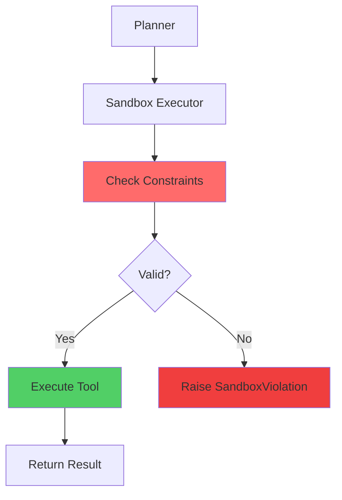
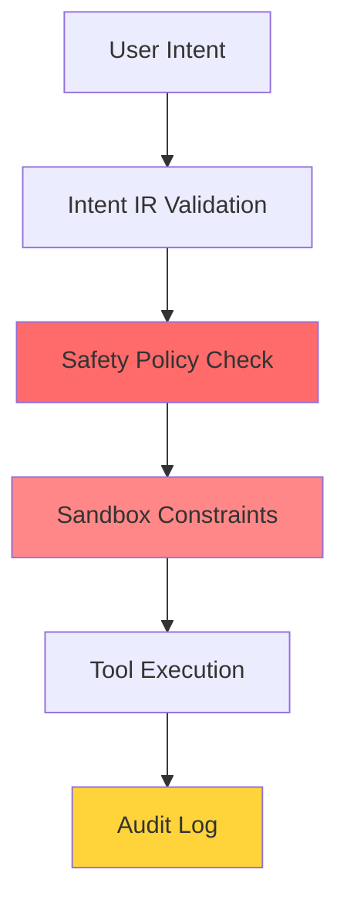

# Sandboxing and Execution Safety

## Purpose

Prevent tools from causing damage outside their intended scope, even if:
- LLM generates incorrect plans
- Tools have bugs
- User makes mistakes

## Architecture



## Constraint Types

### 1. Filesystem Constraints

Control what paths can be read/written:

```python
constraints = SandboxConstraints(
    allowed_read_paths={"/home/user"},
    allowed_write_paths={"/home/user/projects"},
    forbidden_paths={"/etc", "/sys", "/proc"}
)
```

**Validation:**
- Convert all paths to absolute
- Check if target path is under allowed parent
- Forbidden paths override everything

### 2. Time Constraints

Prevent operations from running forever:

```python
constraints = SandboxConstraints(
    max_execution_time=30  # seconds
)
```

**Implementation:**
- Set SIGALRM signal handler
- Raise SandboxTimeout if exceeded
- Automatically cleaned up after execution

### 3. Resource Constraints

Limit memory and file sizes (future):

```python
constraints = SandboxConstraints(
    max_memory_mb=512,
    max_file_size_mb=100
)
```

### 4. Network Constraints

Control network access:

```python
constraints = SandboxConstraints(
    allow_network=True,
    allowed_hosts={"api.openai.com", "api.deepseek.com"}
)
```

### 5. Subprocess Constraints

Control process spawning:

```python
constraints = SandboxConstraints(
    allow_subprocess=True,
    max_subprocesses=5
)
```

## Constraint Profiles

Pre-defined constraint sets for common scenarios:

### Safe Defaults
```python
get_safe_defaults()
# Read: anywhere
# Write: ~/home and /tmp
# Network: no
# Time: 30s
```

### Restricted
```python
get_restricted()
# Read: ~/home only
# Write: ~/.zenus/tmp only
# Network: no
# Time: 10s
```

### Permissive
```python
get_permissive()
# Read: anywhere
# Write: ~/home and /tmp
# Network: yes
# Time: 300s
```

### Filesystem Only
```python
get_filesystem_only()
# Read/Write: ~/home only
# Network: no
# Subprocess: no
```

## Usage Example

### Basic Sandboxed Execution

```python
from sandbox.executor import SandboxExecutor
from sandbox.constraints import get_safe_defaults

executor = SandboxExecutor(get_safe_defaults())

# This will succeed
result = executor.execute(
    my_tool.scan,
    path="/home/user/Downloads"
)

# This will raise SandboxViolation
result = executor.execute(
    my_tool.write,
    path="/etc/important_config"  # forbidden!
)
```

### Tool-Level Integration

```python
from sandbox.executor import SandboxedTool

class SafeFileOps(SandboxedTool):
    def __init__(self):
        super().__init__(get_filesystem_only())
    
    def write_file(self, path, content):
        # Automatically sandboxed
        return self.execute_safe(
            self._write_impl,
            path, content
        )
```

## Current vs Future Implementation

### Current (Phase 1)

**Validation Layer:**
- Check paths against constraints
- Timeout enforcement via signals
- Raise exceptions on violations

**Limitations:**
- No process isolation
- No memory limits (yet)
- No network interception

### Future (Phase 2+)

**Process Isolation:**
- Use bubblewrap, firejail, or containers
- True filesystem namespaces
- Network namespaces
- cgroups for resource limits

**Example future call:**
```bash
bwrap \
  --ro-bind /usr /usr \
  --bind ~/.zenus/tmp /tmp \
  --unshare-net \
  --die-with-parent \
  -- zenus-tool-executor plan.json
```

## Safety Layers

Zenus has multiple safety layers:



1. **Intent IR Schema:** Only valid operations allowed
2. **Safety Policy:** Risk-based gates
3. **Sandbox Constraints:** Filesystem/resource boundaries
4. **Tool Implementation:** Defensive programming
5. **Audit Logging:** Post-execution review

## When Sandboxing Triggers

| Scenario | Constraint Violated | Result |
|----------|---------------------|--------|
| Write to `/etc/config` | Forbidden path | SandboxViolation |
| Write to `/home/user/.ssh/` | Forbidden path | SandboxViolation |
| Read `/home/user/file.txt` | Allowed read | ✓ Success |
| Operation takes 60s | Time limit (30s) | SandboxTimeout |
| Network request | Network disabled | SandboxViolation |

## Design Philosophy

**Fail-safe, not fail-secure:**
- If uncertain → deny
- If path resolution fails → deny
- If time limit unclear → apply default

**Defense in depth:**
- Multiple validation layers
- Assume every component can fail
- Log all denials for analysis

**User control:**
- Constraints can be relaxed per-operation
- User can override (with confirmation)
- Audit trail shows what ran and under what constraints

## Integration with Adaptive Planner

Sandbox violations can trigger adaptation:

```python
try:
    executor.execute(tool.write, path="/etc/config")
except SandboxViolation:
    # Adapt: suggest alternative path
    alternative = adapt_on_sandbox_violation(path)
    executor.execute(tool.write, path=alternative)
```

## Why This Matters

Without sandboxing:
```
User: "delete old logs"
LLM: delete /var/log/* (wrong path!)
Result: System broken ❌
```

With sandboxing:
```
User: "delete old logs"
LLM: delete /var/log/*
Sandbox: SandboxViolation (forbidden path)
Result: Error, system safe ✓
```

Sandboxing is what makes autonomous execution safe.
